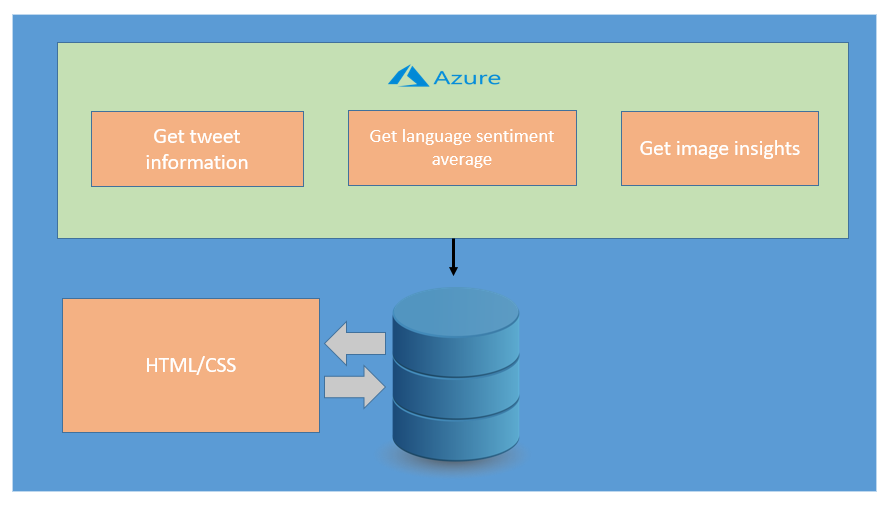
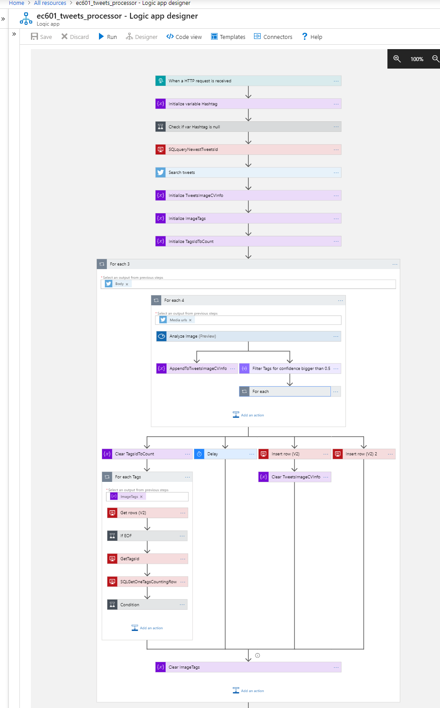

# EC601_01

## Product Description
Our application will supply a user with a summary of content specified by a twitter handle or twitter hastag. The application also porvides the user with a sentiment(positive or negative) of the content recolected.

## Target Users
Our application can provide a prediction of the food/materials they should buy or concentrate on marketing within their business. Features which allow the use determine the trends of food for a period of time can be used in many ways by:

* ### Restaurant Owners
* ### Food Bloggers

## User Stories

### Stories:

* As a restaurant owner I want to know the trending ingredients within a period of time.
* As a restaurant owner and food blogger I want to know the trending dishes
* As a restaurant owner I would like to know trends within specific seasons of the year.
* As a restaurant owner I would like to know the food trend sentiment
  * Example: Getting the sentiment of desserts during Christmas, will allow restaurant owner to market/announce new dessert options based on this sentiment.
* As a food blogger I would like to know the sentiment of specific dishes, in order to write positive or negative reviews on those dishes.

## Architecture

# demo
https://ec601.azurewebsites.net
