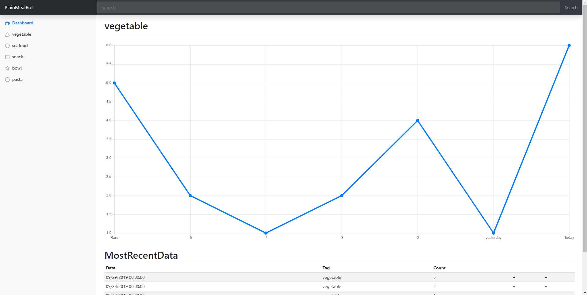
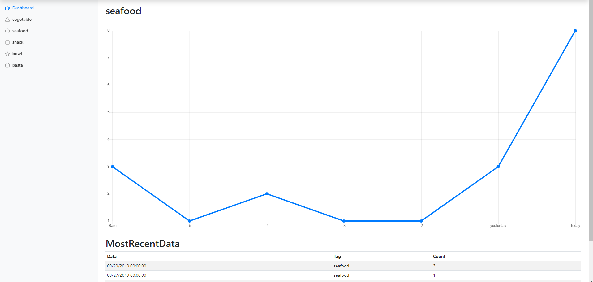

# EC601_01

## Mission
Our mission is to provide our users better insight into their customers and consumers so they can better serve them.

## Product Description
Our application will supply a user with a summary of content specified by a twitter handle or twitter hastag. The application also porvides the user with a sentiment(positive or negative) of the content recolected.

## Target Users
Our application can provide a prediction of the food/materials they should buy or concentrate on marketing within their business. Features which allow the use determine the trends of food for a period of time can be used in many ways by:

* ### Restaurant Owners
* ### Food Bloggers

## User Stories

### Stories:

* As a restaurant owner I want to know the trending ingredients within a period of time.
* As a restaurant owner and food blogger I want to know the trending dishes
* As a restaurant owner I would like to know trends within specific seasons of the year.
* As a restaurant owner I would like to know the food trend sentiment
  * Example: Getting the sentiment of desserts during Christmas, will allow restaurant owner to market/announce new dessert options based on this sentiment.
* As a food blogger I would like to know the sentiment of specific dishes, in order to write positive or negative reviews on those dishes.

## Architecture

## demo
https://ec601.azurewebsites.net

# Product Mission
## User Interface Design for main user story if required
https://ec601.azurewebsites.net
## System Design and how your design addresses your user stories.
* Webside <=======SQL server<============AzureLogicApp<=============Twitter
*                     ↑                         ↑ 
*                     |                         |
*                     |                         |
*                     |                         ↓
*                     ↓                   Microsoft Computer Vision
*             Python NLP processer<=========>Google NLP API
* This is an asynchronous system. AzureLogicApp is triggered by a timer to update tweets from Twitter api and tag the media in the tweets at the same time; NLP processer updates sentiment value by pull tweets' text from SQL server and push results to SQL server; And the website based on ASP.net Core gets data when users are requesting.
## Test document providing how each test case addresses the user stories
 * Launch browser and visit https://ec601.azurewebsites.net, see most recently Tweets in hashtag #朴素一餐(One Plain Meal) sentiment score.
 * Also, users are allow to check the trend of different types of foods, like coffee, meat, fast food,etc,. To try this feature, please use the search input in the top of the page.
## Result of testing (screen shots, etc.)

# Lessons learned
## What you liked doing?
 Both: Coding & learning new things.
## What you could have done better?
 Haoyang: Website structure and content. More efficent tweet processing programs.
 Amanda: Time management

## What you will avoid in the future?
 Overestimate my ability.
